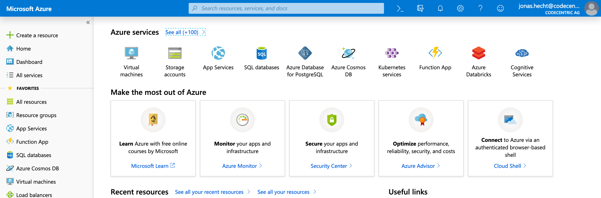

# molecule-ansible-azure
[](https://travis-ci.org/jonashackt/molecule-ansible-azure)
[](https://docs.ansible.com/ansible/latest/index.html)
[](https://molecule.readthedocs.io/en/latest/)
[](https://testinfra.readthedocs.io/en/latest/)
[](https://aws.amazon.com/cli/)

Example projects showing how to do test-driven development of Ansible roles and running those tests on multiple Cloud providers at the same time

This project build on top of [molecule-ansible-docker-vagrant](https://github.com/jonashackt/molecule-ansible-docker-vagrant), where all the basics on how to do test-driven development of Ansible roles with Molecule is described. Have a look into the blog series so far:

* [Test-driven infrastructure development with Ansible & Molecule](https://blog.codecentric.de/en/2018/12/test-driven-infrastructure-ansible-molecule/)
* [Continuous Infrastructure with Ansible, Molecule & TravisCI](https://blog.codecentric.de/en/2018/12/test-driven-infrastructure-ansible-molecule/)
* [Continuous cloud infrastructure with Ansible, Molecule & TravisCI on AWS](https://blog.codecentric.de/en/2019/01/ansible-molecule-travisci-aws/)

## What about Multicloud?

Developing infrastructure code according to prinicples like test-driven development and continuous integration is really great! But what about pushing this to the next level? As [Molecule](https://molecule.readthedocs.io/en/latest/) is able to handle everything Ansible is albe to access, why not run our test automatically on all major cloud platforms at the same time?

With this, we would not only have a security net for our infrastructure code, but would also be safe regarding a switch of our current cloud or data center provider. Lot's of people talk about the unclear costs of this switch. **** If our infrastructure code would be able to run on every cloud platform possible, we would simply be able to switch to whatever platform we want - and all with just the virtually no expenses.Why not just reduce these to zero?!


## Add Azure to the game

Let's start with AWS by just forking [molecule-ansible-google-cloud](https://github.com/jonashackt/molecule-ansible-google-cloud), since there should be mostly everything needed to use Molecule with a Cloud provider.


First, you'll need a valid [Azure account](https://azure.microsoft.com), which happens to be a Microsoft account (you could also use that to access Office 365 and other things). If everything is fine with your account, you should be able to access the Azure Portal at [https://portal.azure.com/#home](https://portal.azure.com/#home):

 


According to the Molecule docs about [the Azure driver](https://molecule.readthedocs.io/en/latest/configuration.html#azure), we then we need to install Azure support for Molecule:

```
pip3 install ansible[azure]
```

Compared to AWS and GCE this time we install pip's Ansible package with Azure support, not Molecule itself.


Now let's initialize a new Molecule scenario calles `azure-ubuntu` inside our Ansible role:

```
cd molecule-ansible-azure/docker

molecule init scenario --driver-name azure --role-name docker --scenario-name azure-ubuntu
```

That should create a new directory `azure-ubuntu` inside the `docker/molecule` folder.  We'll integrate the results into our multi scenario project in a second.

Now let's dig into the generated [molecule.yml](docker/molecule/azure-ubuntu/molecule.yml):

```yaml
scenario:
  name: azure-ubuntu

driver:
  name: azure
platforms:
  - name: azure-ubuntu

provisioner:
  name: ansible
  lint:
    name: ansible-lint
    enabled: false
  playbooks:
    converge: ../playbook.yml

lint:
  name: yamllint
  enabled: false

verifier:
  name: testinfra
  directory: ../tests/
  env:
    # get rid of the DeprecationWarning messages of third-party libs,
    # see https://docs.pytest.org/en/latest/warnings.html#deprecationwarning-and-pendingdeprecationwarning
    PYTHONWARNINGS: "ignore:.*U.*mode is deprecated:DeprecationWarning"
  lint:
    name: flake8
  options:
    # show which tests where executed in test output
    v: 1

```

As we already tuned the `molecule.yml` files for our other scenarios like `aws-ec2-ubuntu`, we know what to change here. `provisioner.playbook.converge` needs to be configured, so the one `playbook.yml` could be found.

Also the `verifier` section has to be enhanced to gain all the described advantages like supressed deprecation warnings and the better test result overview.

As you may noticed, the driver now uses `azure` and the platform is pre-configured with only a concrete `name`. Here we just tune the instance name to `azure-ubuntu`.


### Configure Azure Ressource Manager (RM) image

Compared to the AWS and GCE Molecule drivers, these are only one configuration parameters. But there have to be more, just think about region or image configuration! Therefore we need to dive into the [create.yml](docker/molecule/azure-ubuntu/create.yml):

```yaml

- name: Create
  hosts: localhost
  connection: local
  gather_facts: false
  no_log: "{{ not (lookup('env', 'MOLECULE_DEBUG') | bool or molecule_yml.provisioner.log|default(false) | bool) }}"
  vars:
    resource_group_name: molecule
    location: westus
    ssh_user: molecule
    ssh_port: 22
    virtual_network_name: molecule_vnet
    subnet_name: molecule_subnet
    keypair_path: "{{ lookup('env', 'MOLECULE_EPHEMERAL_DIRECTORY') }}/ssh_key"
  tasks:
  ...
  - name: Create molecule instance(s)
        azure_rm_virtualmachine:
          resource_group: "{{ resource_group_name }}"
          name: "{{ item.name }}"
          vm_size: Standard_A0
          admin_username: "{{ ssh_user }}"
          public_ip_allocation_method: Dynamic
          ssh_password_enabled: false
          ssh_public_keys:
            - path: "/home/{{ ssh_user }}/.ssh/authorized_keys"
              key_data: "{{ keypair.ssh_public_key }}"
          image:
            offer: CentOS
            publisher: OpenLogic
            sku: '7.4'
            version: latest
        register: server
        with_items: "{{ molecule_yml.platforms }}"
        async: 7200
        poll: 0
  ...
```

And there we are! Molecule makes heavy usage of Ansible's [azure_rm_virtualmachine](https://docs.ansible.com/ansible/latest/modules/azure_rm_virtualmachine_module.html) module.

Now as we chose to implement the use case of a [standard Ubuntu Docker installation](https://docs.docker.com/install/linux/docker-ce/ubuntu/#install-docker-ce-1), we need to switch the `image.offer` to another fitting one. So let's adhere to the docs' standard way and use Azure CLI to list available image configurations for our location. 

Therefore Azure CLI needs to be available on your machine. On my Mac I use `brew install azure-cli` to install it. Now we can do:

```
$ az vm image list --output table
You are viewing an offline list of images, use --all to retrieve an up-to-date list
Offer          Publisher               Sku                 Urn                                                             UrnAlias             Version
-------------  ----------------------  ------------------  --------------------------------------------------------------  -------------------  ---------
CentOS         OpenLogic               7.5                 OpenLogic:CentOS:7.5:latest                                     CentOS               latest
CoreOS         CoreOS                  Stable              CoreOS:CoreOS:Stable:latest                                     CoreOS               latest
Debian         credativ                9                   credativ:Debian:9:latest                                        Debian               latest
openSUSE-Leap  SUSE                    42.3                SUSE:openSUSE-Leap:42.3:latest                                  openSUSE-Leap        latest
RHEL           RedHat                  7-RAW               RedHat:RHEL:7-RAW:latest                                        RHEL                 latest
SLES           SUSE                    15                  SUSE:SLES:15:latest                                             SLES                 latest
UbuntuServer   Canonical               18.04-LTS           Canonical:UbuntuServer:18.04-LTS:latest                         UbuntuLTS            latest
WindowsServer  MicrosoftWindowsServer  2019-Datacenter     MicrosoftWindowsServer:WindowsServer:2019-Datacenter:latest     Win2019Datacenter    latest
WindowsServer  MicrosoftWindowsServer  2016-Datacenter     MicrosoftWindowsServer:WindowsServer:2016-Datacenter:latest     Win2016Datacenter    latest
WindowsServer  MicrosoftWindowsServer  2012-R2-Datacenter  MicrosoftWindowsServer:WindowsServer:2012-R2-Datacenter:latest  Win2012R2Datacenter  latest
WindowsServer  MicrosoftWindowsServer  2012-Datacenter     MicrosoftWindowsServer:WindowsServer:2012-Datacenter:latest     Win2012Datacenter    latest
WindowsServer  MicrosoftWindowsServer  2008-R2-SP1         MicrosoftWindowsServer:WindowsServer:2008-R2-SP1:latest         Win2008R2SP1         latest
```

As there we can spot a fitting Ubuntu 18.04 image inside the list, we should be able to configure Molecule. As we already saw inside the generated [create.yml](docker/molecule/azure-ubuntu/create.yml), the `azure_rm_virtualmachine` module uses a `with_items: "{{ molecule_yml.platforms }}"` configuration, so we only need to change the `create.yml` sligthly:

```yaml
  ...
  - name: Create molecule instance(s)
        azure_rm_virtualmachine:
          ...
          image: "{{ item.image }}"
        register: server
        with_items: "{{ molecule_yml.platforms }}"
        async: 7200
        poll: 0
  ...
```

With this, we can now move to our [molecule.yml](docker/molecule/azure-ubuntu/molecule.yml) and configure the Azure image:

```yaml
scenario:
  name: gcp-gce-ubuntu

driver:
  name: azure
platforms:
  - name: azure-ubuntu
    image:
      offer: UbuntuServer
      publisher: Canonical
      sku: 18.04-LTS
      version: latest
  ...
```


### Configure Azure location

We shouldn't forget the configuration of our Azure location (compare with GCP's zone and AWS' region). To find out the correct location, we can leverage the Azure CLI again. As the docs state, there is `az account list-locations` to list the configured location for your account. Running the command will maybe result in the following error:

```
$ az account list-locations
Please run 'az login' to setup account.
```

Now to interact with the `az account` commands, you'll need a valid Azure subscription. You can start with [the free 12 month subscription](https://azure.microsoft.com/en-us/free/) for example. If you entered everything, the subscription should be available inside the Azure Portal and the `azure login` command should work like this:

```
$ az login
Note, we have launched a browser for you to login. For old experience with device code, use "az login --use-device-code"
You have logged in. Now let us find all the subscriptions to which you have access...
[
  {
    "cloudName": "AzureCloud",
    "id": "1f0021b3-xxx-xxxx-xxxx-xxxxxxxxxxx",
    "isDefault": true,
    "name": "Free Trial",
    "state": "Enabled",
    "tenantId": "xxxxxxx-xxxx-xxxx-xxxx-xxxxxxxxxx",
    "user": {
      "name": "jonas.hecht@codecentric.de",
      "type": "user"
    }
  }
]
```

Having the Azure CLI successfully logged in, we should try to run `az account list-locations` again. Just pick a location, which suits you best. I took `westeurope` for example and change the [create.yml](docker/molecule/azure-ubuntu/create.yml):

```yaml
- name: Create
  ...
  vars:
    resource_group_name: molecule
    location: westeurope
    ssh_user: molecule
    ssh_port: 22
```


### Creating a Azure RM VM instance with Molecule


Now we should have everything prepared. Let's try to run our first Molecule test on Azure (including `--debug` so that we see what's going on):

```
molecule --debug create --scenario-name azure-ubuntu
```

Open your Google Cloud Compute Engine dashboard and you should see the instance beeing created by Molecule:


### Install needed Python packages: gcloud, apache-libcloud & pycrypto

We need to have `gcloud cli` installed, which is packaged with the Google Cloud SDK. BUT don't install it this way, again use Python package manager pip instead:

```
pip3 install gcloud apache-libcloud pycrypto
```

We also need to install [Apache Libcloud](https://libcloud.apache.org/), so it's already attached to the pip install command. Libcloud is used to interact with Google Compute Engine by Molecule. Also [PyCrypto](https://pypi.org/project/pycrypto/) needs to be installed in order to let Molecule connect to GCP successfully.


### Create a Service Account inside GCE & configure Apache Libcloud

As [described in the docs](https://libcloud.readthedocs.io/en/latest/compute/drivers/gce.html#connecting-to-google-compute-engine) we need to [create a Service account](https://libcloud.readthedocs.io/en/latest/compute/drivers/gce.html#service-account) inside our Google Cloud Console:

> Select the existing or newly created project and go to IAM & Admin -> Service Accounts -> Create service account to create a new service account. 

Provide the service account with a speaking name like `molecule`, then click __NEXT__. Grant the service account the `Owner` role and again click __NEXT__.

Select the role `Owner` and at the tab `Grant users access to this service account (optional)` you should click on __create key__ to create and download new private key you will use to authenticate (I went with the `.json` format). Place the json file into a folder inside your profile:

```
cd ~
mkdir .googlecloud
mv ~/Downloads/yourprojectname-youridhere.json .googlecloud/yourprojectname-youridhere.json
```

Now the Google Cloud credentials json file should reside in `/Users/youruserhere/.googlecloud/yourprojectname-youridhere.json`.

At the end you're service account should be listed inside your projects settings:


### Configure GCE credentials for Ansible gce Module

If we have a more detailed look into the [create.yml](docker/molecule/gcp-gce-ubuntu/create.yml) playbook we see, that Molecule use Ansible's [gce Module](https://docs.ansible.com/ansible/latest/modules/gce_module.html) to create Google Compute Engine instances.

And the `create.yml` uses 3 environment variables, that we need to set in order to execute Molecule successfully:`
 
* `GCE_SERVICE_ACCOUNT_EMAIL`: Copy the email address of the created service account.
* `GCE_CREDENTIALS_FILE`: We need to place the path to the credentials file here (like `/Users/youruserhere/.googlecloud/yourprojectname-youridhere.json`)
* `GCE_PROJECT_ID`: Copy the project Id from the project dashboard:


Now set all those environment variables locally:

```
export GCE_SERVICE_ACCOUNT_EMAIL=libcloud@yourprojectname-youridhere.iam.gserviceaccount.com
export GCE_CREDENTIALS_FILE=~/.googlecloud/yourprojectname-youridhere.json
export GCE_PROJECT_ID=yourprojectname-youridhere
```


### Creating a Google Compute Engine instance with Molecule


Now we should have everything prepared. Let's try to run our first Molecule test on Google Compute Engine (including `--debug` so that we see what's going on):

```
molecule --debug create --scenario-name gcp-gce-ubuntu
```

Open your Google Cloud Compute Engine dashboard and you should see the instance beeing created by Molecule:


### Prepare step fails with no such identity: /Users/yourUserHere/.ssh/google_compute_engine & user@yourIpHere: Permission denied (publickey).

Until here, we didn't need to have the [Google Cloud SDK](https://cloud.google.com/sdk/?hl=en) installed - although I was wondering all the time, when we will need it. And here we are, the [prepare.yml](docker/molecule/gcp-gce-ubuntu/prepare.yml) (and every other) playbook will need the file `/Users/yourUserHere/.ssh/google_compute_engine` to be present to be able to connect to your GCE instances. Otherwise the Molecule execution will fail with something like the following:

```
fatal: [gcp-gce-ubuntu]: UNREACHABLE! => {
        "changed": false,
        "msg": "Failed to connect to the host via ssh: Warning: Permanently added '35.198.116.39' (ECDSA) to the list of known hosts.\r\nno such identity: /Users/yourUserHere/.ssh/google_compute_engine: No such file or directory\r\nyourUserHere@35.198.116.39: Permission denied (publickey).",
        "unreachable": true
    }
```

So now we need to install the Google Cloud SDK:

```
brew cask install google-cloud-sdk
```

If the SDK was successfully installed, we need to give our Google Cloud SDK the needed rights:

```
gcloud auth login
```

This will open your Browser and you'll need to confirm all the occurring questions.

Now configure your project Id in gcloud CLI:

```
gcloud config set project testproject-233213
```

We're now also able to leverage the gcloud CLI for our needs. Let's have a look onto our running instances for example:

```
$ gcloud compute instances list
NAME            ZONE            MACHINE_TYPE  PREEMPTIBLE  INTERNAL_IP  EXTERNAL_IP    STATUS
gcp-gce-ubuntu  europe-west3-a  f1-micro                   10.156.0.5   35.198.116.39  RUNNING
```

Now we're able to generate the necessary `/Users/yourUserHere/.ssh/google_compute_engine` along with `/Users/yourUserHere/.ssh/google_compute_known_hosts`:

```
gcloud compute ssh gcp-gce-ubuntu
```

Finally we should be able to run successfully locally:

```
molecule --debug create --scenario-name gcp-gce-ubuntu
```

[](https://asciinema.org/a/231709)


### Configure Travis CI to run our Molecule test automatically on Google Cloud Platform

There are only very few sources on how to do that:

https://cloud.google.com/solutions/continuous-delivery-with-travis-ci

#### Install needed Python packages: gcloud, apache-libcloud & pycrypto

Like as we're already used to locally, we need to have `gcloud cli` installed - alongside [Apache Libcloud](https://libcloud.apache.org/) &  [PyCrypto](https://pypi.org/project/pycrypto/). So let's add that to our [.travis.yml](.travis.yml):

```
pip install gcloud apache-libcloud pycrypto
```

Now this should output the `gcloud version` on TravisCI like you're used to locally:

```
$ gcloud version
Google Cloud SDK 236.0.0
bq 2.0.41
core 2019.02.22
gsutil 4.36
```


#### Authenticate gcloud CLI against GCP

As we can't use the interactive mode of `gcloud auth login` on TravisCI, we use encrypted service account credentials to authenticate gcloud CLI non-interactively like this: `gcloud auth activate-service-account --key-file client-secret.json`

So let's do it! First we need to encrypt our service account .json key file. [There's a documentation on how to encrypt files in TravisCI](https://docs.travis-ci.com/user/encrypting-files/) - and here's the fast way:

Install TravisCI CLI on your local machine (__not on Travis!__):

```
brew install travis
```

Then login the CLI to your Travis account locally:

```
travis login
```

Now copy the service account .json key file `.googlecloud/yourprojectname-youridhere.json` to the project's root (__BUT don't check this into source control!__) and create an ignore entry in the [.gitignore](.gitignore) file:

```
# Google Cloud service account key file for TravisCI
testproject-233213-45d56e1b7fc5.json
...
```

We can now encrypt our json key file with the `travis encrypt-file` command:

```
$ travis encrypt-file testproject-233213-45d56e1b7fc5.json 
Detected repository as jonashackt/molecule-ansible-aws-gcp-azure, is this correct? |yes| yes
encrypting testproject-233213-45d56e1b7fc5.json for jonashackt/molecule-ansible-aws-gcp-azure
storing result as testproject-233213-45d56e1b7fc5.json.enc
storing secure env variables for decryption

Please add the following to your build script (before_install stage in your .travis.yml, for instance):

    openssl aes-256-cbc -K $encrypted_c0be5bd8086d_key -iv $encrypted_c0be5bd8086d_iv -in testproject-233213-45d56e1b7fc5.json.enc -out testproject-233213-45d56e1b7fc5.json -d

Pro Tip: You can add it automatically by running with --add.

Make sure to add testproject-233213-45d56e1b7fc5.json.enc to the git repository.
Make sure not to add testproject-233213-45d56e1b7fc5.json to the git repository.
Commit all changes to your .travis.yml.
```

As the output already states, we need to add the `openssl aes-256-cbc -K ...` command to our [.travis.yml](.travis.yml) right after the gcloud CLI installation:

```
...
- gcloud version
# Decrypt Google Cloud Platform service account json key file
- openssl aes-256-cbc -K $encrypted_c0be5bd8086d_key -iv $encrypted_c0be5bd8086d_iv -in testproject-233213-45d56e1b7fc5.json.enc -out testproject-233213-45d56e1b7fc5.json -d
...
``` 

Don't forget to check in the __encrypted__ service account json key file `testproject-233213-45d56e1b7fc5.json.enc` into your Git repo.

Now finally add the `gcloud auth activate-service-account` command to your [.travis.yml](.travis.yml):

```
- gcloud auth activate-service-account --key-file testproject-233213-45d56e1b7fc5.json
```


#### SSH config on TravisCI

First we need to configure the GCE project id inside TravisCI settings as `GCP_GCE_PROJECT_ID` environment variable and configure the project to be used by `gcloud` CLI inside the [.travis.yml](.travis.yml):

```
- gcloud config set project $GCP_GCE_PROJECT_ID
```

Just as we are used to locally, we now need to generate the necessary `/Users/yourUserHere/.ssh/google_compute_engine` along with `/Users/yourUserHere/.ssh/google_compute_known_hosts` files - but this time on TravisCI!

Therefore adding `gcloud compute ssh gcp-gce-ubuntu` into our [.travis.yml](.travis.yml) would be the an idea. But running this command before Molecule actually fires up our GCP instance will result in an error - because we cannot ssh into a non-existing machine! The following error would occur:

```
ERROR: (gcloud.compute.ssh) Underspecified resource [gcp-gce-ubuntu].
```

We need a non-interactive version of `gcloud compute ssh gcp-gce-ubuntu --zone=europe-west3-a` (we need the `--zone` flag, because we cannot choose the zone interactively here). And the trick here is really to just use the `--command` parameter and directly `exit` the prompt in the same command:

```
gcloud compute ssh gcp-gce-ubuntu --zone=europe-west3-a --command "exit"
```

But as you need a running machine to ssh into it, we need to do this inside the standard Molecule process. After Molecule has fired up a machine, the `prepare.yml` is executed. This is our chance! If we could run the `gcloud compute ssh` command there, we should prevent ourselves from the dreaded `yourUserHere@35.198.116.39: Permission denied (publickey).` error!

Therefore we add the following to the [prepare.yml](docker/molecule/gcp-gce-ubuntu/prepare.yml):

```yaml
- hosts: localhost
  connection: local
  gather_facts: false
  tasks:
    - name: Execute gcloud compute ssh to obtain needed files for ssh - and exit in the same command
      shell: gcloud compute ssh gcp-gce-ubuntu --zone=europe-west3-a --command "exit"
      changed_when: false

...

```

#### Finally run Molecule on GCP

Now there should be everything in place to finally run our Molecule test on Travis! Therefore add the well known `molecule test --scenario-name gcp-gce-ubuntu` into your Travis config. The [.travis.yml](.travis.yml) should now look something like this:

```yaml
sudo: false
language: python

env:
- GCE_CREDENTIALS_FILE=$TRAVIS_BUILD_DIR/testproject-233213-45d56e1b7fc5.json GCE_SERVICE_ACCOUNT_EMAIL=molecule@testproject-233213.iam.gserviceaccount.com GCE_PROJECT_ID=testproject-233213

services:
- docker

cache: pip

install:
- pip install molecule
- pip install docker-py
- pip install gcloud apache-libcloud pycrypto

# Was gcloud CLI successfully installed?
- gcloud version
# Decrypt Google Cloud Platform service account json key file
- openssl aes-256-cbc -K $encrypted_c0be5bd8086d_key -iv $encrypted_c0be5bd8086d_iv -in testproject-233213-45d56e1b7fc5.json.enc -out testproject-233213-45d56e1b7fc5.json -d
# Authenticate against GCP with decrypted key file
- gcloud auth activate-service-account --key-file testproject-233213-45d56e1b7fc5.json
  # Set GCP project id
- gcloud config set project $GCP_GCE_PROJECT_ID

script:
- cd docker
# Run Molecule test on GCP
- molecule create --scenario-name gcp-gce-ubuntu
- molecule converge --scenario-name gcp-gce-ubuntu
- molecule verify --scenario-name gcp-gce-ubuntu
- molecule destroy --scenario-name gcp-gce-ubuntu
```


## Add Azure to the party


