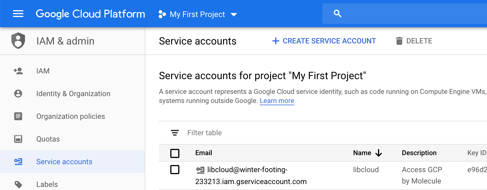
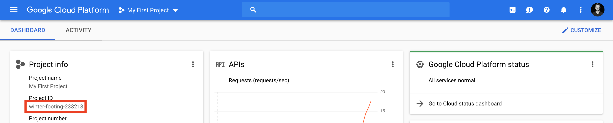
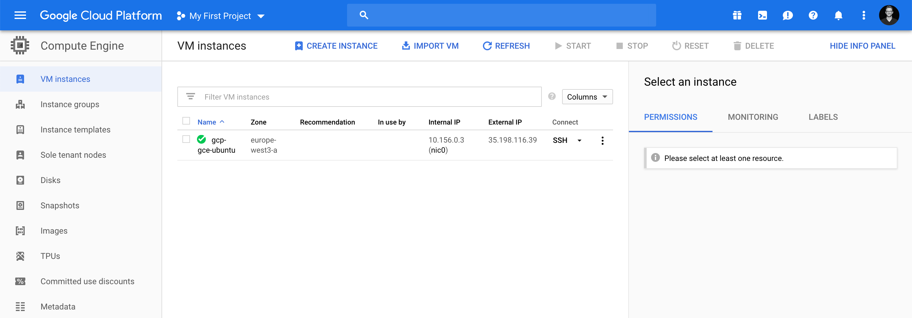

# molecule-ansible-aws-gcp-azure
[](https://travis-ci.org/jonashackt/molecule-ansible-aws-gcp-azure)
[](https://docs.ansible.com/ansible/latest/index.html)
[](https://molecule.readthedocs.io/en/latest/)
[](https://testinfra.readthedocs.io/en/latest/)
[](https://aws.amazon.com/cli/)
[](https://aws.amazon.com/cli/)

Example projects showing how to do test-driven development of Ansible roles and running those tests on multiple Cloud providers at the same time

This project build on top of [molecule-ansible-docker-vagrant](https://github.com/jonashackt/molecule-ansible-docker-vagrant), where all the basics on how to do test-driven development of Ansible roles with Molecule is described. Have a look into the blog series so far:

* [Test-driven infrastructure development with Ansible & Molecule](https://blog.codecentric.de/en/2018/12/test-driven-infrastructure-ansible-molecule/)
* [Continuous Infrastructure with Ansible, Molecule & TravisCI](https://blog.codecentric.de/en/2018/12/test-driven-infrastructure-ansible-molecule/)
* [Continuous cloud infrastructure with Ansible, Molecule & TravisCI on AWS](https://blog.codecentric.de/en/2019/01/ansible-molecule-travisci-aws/)

## What about Multicloud?

Developing infrastructure code according to prinicples like test-driven development and continuous integration is really great! But what about pushing this to the next level? As [Molecule](https://molecule.readthedocs.io/en/latest/) is able to handle everything Ansible is albe to access, why not run our test automatically on all major cloud platforms at the same time?

With this, we would not only have a security net for our infrastructure code, but would also be safe regarding a switch of our current cloud or data center provider. Lot's of people talk about the unclear costs of this switch. **** If our infrastructure code would be able to run on every cloud platform possible, we would simply be able to switch to whatever platform we want - and all with just the virtually no expenses.Why not just reduce these to zero?!


## A selection of cloud providers: Azure, Google, AWS

So let's pick some more providers so that we can safely speak about going 'Multicloud':

* [Molecule's Azure driver](https://molecule.readthedocs.io/en/latest/configuration.html#azure)
* [Molecule's Google Compute Engine (GCE) driver](https://molecule.readthedocs.io/en/latest/configuration.html#gce)
* We already know [how to use Molecule with AWS EC2](https://blog.codecentric.de/en/2019/01/ansible-molecule-travisci-aws/). 


Let's start with AWS by just forking [molecule-ansible-docker-vagrant](https://github.com/jonashackt/molecule-ansible-docker-vagrant), since there should be mostly everything needed to use Molecule with AWS.

This should run in no time :)


## Add Google Cloud Platform to the game

First you'll need a valid [Google Cloud Platform](https://cloud.google.com) account - you should have at least 300$ using a test account for free.

Then we need to install Google Compute Engine (GCE) support for Molecule:

```
pip3 install molecule[gce]
```

Now let's initialize a new Molecule scenario calles `gcp-gce-ubuntu` inside our Ansible role:

```
cd molecule-ansible-aws-gcp-azure/docker

molecule init scenario --driver-name gce --role-name docker --scenario-name gcp-gce-ubuntu
```

That should create a new directory `gcp-gce-ubuntu` inside the `docker/molecule` folder.  We'll integrate the results into our multi scenario project in a second.

Now let's dig into the generated [molecule.yml](docker/molecule/gcp-gce-ubuntu/molecule.yml):

```yaml
s---
 scenario:
   name: gcp-gce-ubuntu
 
 driver:
   name: gce
 platforms:
   - name: gcp-gce-ubuntu
     zone: europe-west3-a
     machine_type: f1-micro
     image: ubuntu-1804-bionic-v20190212a 
 
 provisioner:
   name: ansible
   lint:
     name: ansible-lint
     enabled: false
   playbooks:
     converge: ../playbook.yml
 
 lint:
   name: yamllint
   enabled: false
 
 verifier:
   name: testinfra
   directory: ../tests/
   env:
     # get rid of the DeprecationWarning messages of third-party libs,
     # see https://docs.pytest.org/en/latest/warnings.html#deprecationwarning-and-pendingdeprecationwarning
     PYTHONWARNINGS: "ignore:.*U.*mode is deprecated:DeprecationWarning"
   lint:
     name: flake8
   options:
     # show which tests where executed in test output
     v: 1
```

As we already tuned the `molecule.yml` files for our other scenarios like `aws-ec2-ubuntu`, we know what to change here. `provisioner.playbook.converge` needs to be configured, so the one `playbook.yml` could be found.

Also the `verifier` section has to be enhanced to gain all the described advantages like supressed deprecation warnings and the better test result overview.

As you may noticed, the driver now uses `gce` and the platform is already pre-configured with a concrete `zone`, `machine_type` and a Google Compute Engine image. Here we just tune the instance name to `gcp-gce-ubuntu` and the `zone` according to our preferred region (see [available regions & zones here](https://cloud.google.com/compute/docs/regions-zones/regions-zones#available)).

Let's also configure a suitable image (see [the Image list here](https://console.cloud.google.com/compute/images)) - for us using our "Install Docker on Ubuntu use case", we should choose `ubuntu-1804-bionic-v20190212a`. The preconfigure [Machine Type](https://cloud.google.com/compute/docs/machine-types?hl=en) `f1-micro` should suffice for us.


### Install needed Python packages: gcloud, apache-libcloud & pycrypto

We need to have `gcloud cli` installed, which is packaged with the Google Cloud SDK. BUT don't install it this way, again use Python package manager pip instead:

```
pip3 install gcloud apache-libcloud pycrypto
```

We also need to install [Apache Libcloud](https://libcloud.apache.org/), so it's already attached to the pip install command. Libcloud is used to interact with Google Compute Engine by Molecule. Also [PyCrypto](https://pypi.org/project/pycrypto/) needs to be installed in order to let Molecule connect to GCP successfully.


### Create a Service Account inside GCE & configure Apache Libcloud

As [described in the docs](https://libcloud.readthedocs.io/en/latest/compute/drivers/gce.html#connecting-to-google-compute-engine) we need to [create a Service account](https://libcloud.readthedocs.io/en/latest/compute/drivers/gce.html#service-account) inside our Google Cloud Console:

> Select the existing or newly created project and go to IAM & Admin -> Service Accounts -> Create service account to create a new service account. 

Provide the service account with a speaking name like `molecule`, then click __NEXT__. Grant the service account the `Owner` role and again click __NEXT__.

Select the role `Owner` and at the tab `Grant users access to this service account (optional)` you should click on __create key__ to create and download new private key you will use to authenticate (I went with the `.json` format). Place the json file into a folder inside your profile:

```
cd ~
mkdir .googlecloud
mv ~/Downloads/yourprojectname-youridhere.json .googlecloud/yourprojectname-youridhere.json
```

Now the Google Cloud credentials json file should reside in `/Users/youruserhere/.googlecloud/yourprojectname-youridhere.json`.

At the end you're service account should be listed inside your projects settings:




### Configure GCE credentials for Ansible gce Module

If we have a more detailed look into the [create.yml](docker/molecule/gcp-gce-ubuntu/create.yml) playbook we see, that Molecule use Ansible's [gce Module](https://docs.ansible.com/ansible/latest/modules/gce_module.html) to create Google Compute Engine instances.

And the `create.yml` uses 3 environment variables, that we need to set in order to execute Molecule successfully:`
 
* `GCE_SERVICE_ACCOUNT_EMAIL`: Copy the email address of the created service account.
* `GCE_CREDENTIALS_FILE`: We need to place the path to the credentials file here (like `/Users/youruserhere/.googlecloud/yourprojectname-youridhere.json`)
* `GCE_PROJECT_ID`: Copy the project Id from the project dashboard:



Now set all those environment variables locally:

```
export GCE_SERVICE_ACCOUNT_EMAIL=libcloud@yourprojectname-youridhere.iam.gserviceaccount.com
export GCE_CREDENTIALS_FILE=~/.googlecloud/yourprojectname-youridhere.json
export GCE_PROJECT_ID=yourprojectname-youridhere
```


### Creating a Google Compute Engine instance with Molecule


Now we should have everything prepared. Let's try to run our first Molecule test on Google Compute Engine (including `--debug` so that we see what's going on):

```
molecule --debug create --scenario-name gcp-gce-ubuntu
```

Open your Google Cloud Compute Engine dashboard and you should see the instance beeing created by Molecule:




### Prepare step fails with no such identity: /Users/yourUserHere/.ssh/google_compute_engine & user@yourIpHere: Permission denied (publickey).

Until here, we didn't need to have the [Google Cloud SDK](https://cloud.google.com/sdk/?hl=en) installed - although I was wondering all the time, when we will need it. And here we are, the [prepare.yml](docker/molecule/gcp-gce-ubuntu/prepare.yml) (and every other) playbook will need the file `/Users/yourUserHere/.ssh/google_compute_engine` to be present to be able to connect to your GCE instances. Otherwise the Molecule execution will fail with something like the following:

```
fatal: [gcp-gce-ubuntu]: UNREACHABLE! => {
        "changed": false,
        "msg": "Failed to connect to the host via ssh: Warning: Permanently added '35.198.116.39' (ECDSA) to the list of known hosts.\r\nno such identity: /Users/yourUserHere/.ssh/google_compute_engine: No such file or directory\r\nyourUserHere@35.198.116.39: Permission denied (publickey).",
        "unreachable": true
    }
```

So now we need to install the Google Cloud SDK:

```
brew cask install google-cloud-sdk
```

If the SDK was successfully installed, we need to give our Google Cloud SDK the needed rights:

```
gcloud auth login
```

This will open your Browser and you'll need to confirm all the occurring questions.

Now configure your project Id in gcloud CLI:

```
gcloud config set project testproject-233213
```

We're now also able to leverage the gcloud CLI for our needs. Let's have a look onto our running instances for example:

```
$ gcloud compute instances list
NAME            ZONE            MACHINE_TYPE  PREEMPTIBLE  INTERNAL_IP  EXTERNAL_IP    STATUS
gcp-gce-ubuntu  europe-west3-a  f1-micro                   10.156.0.5   35.198.116.39  RUNNING
```

Now we're able to generate the necessary `/Users/yourUserHere/.ssh/google_compute_engine` along with `/Users/yourUserHere/.ssh/google_compute_known_hosts`:

```
gcloud compute ssh gcp-gce-ubuntu
```

Finally we should be able to run successfully locally:

```
molecule --debug create --scenario-name gcp-gce-ubuntu
```

[](https://asciinema.org/a/231709)


### Configure Travis CI to run our Molecule test automatically on Google Cloud Platform

There are only a few sources on how to do that:

https://cloud.google.com/solutions/continuous-delivery-with-travis-ci

https://stackoverflow.com/questions/38762590/how-to-install-google-cloud-sdk-on-travis


## Add Azure to the party


